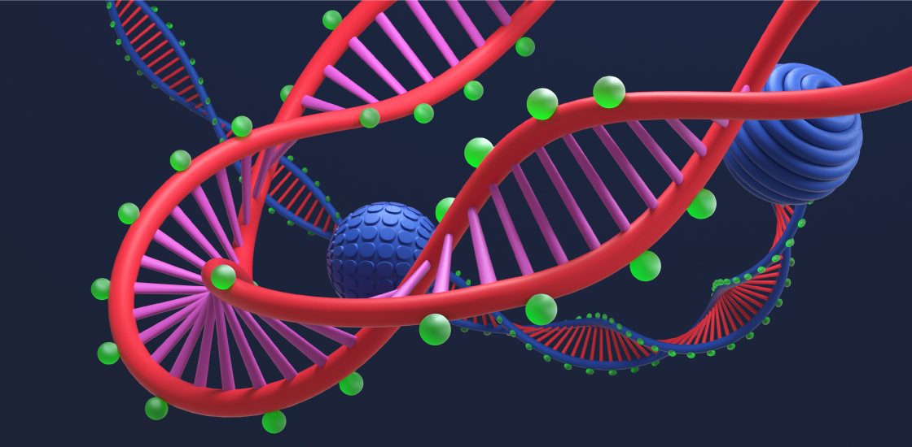

::: {.project-card}

::: {.project-body}
### 🧬 ATAC-seq Peak Overlap & Regulatory Element Analysis

::: {.project-links}
[View on GitHub](https://github.com/Thomas-Nguyen12/ATAC-Seq-Pipeline)
:::

This project focuses on uncovering regulatory differences between cell types using ATAC-seq chromatin accessibility data. I built an analytical workflow that identifies, quantifies, and interprets accessible genomic regions, with a particular focus on peak overlaps, cell-type-specific accessibility, and statistical significance testing.

The pipeline includes:

- Peakset integration & comparison across cell types (e.g., hTSC vs stromal)
- Genome-wide visualisation of accessibility patterns and regulatory hotspots
- Automated preprocessing using UNIX, R, and high-performance computing environments
- Biological interpretation linking accessible regions to potential regulatory elements and imprinting-related mechanisms

This project demonstrates how computational genomics, statistical modelling, and reproducible workflow design can be combined to extract meaningful regulatory insights from large-scale ATAC-seq datasets. It reflects my ability to work at the intersection of data science, bioinformatics, and biological interpretation, turning raw sequencing data into actionable scientific understanding.
:::
:::

::: {.project-card}

::: {.project-body}
### 🧬 RNA-seq Differential Expression & Functional Insight Pipeline

::: {.project-links}
[View on GitHub](https://github.com/Thomas-Nguyen12/RNA-Seq-Pipeline)
:::

This project delivers a full end-to-end RNA-seq analysis workflow designed to uncover how gene expression changes across biological conditions. I built a reproducible pipeline that processes raw FASTQ files through quality control, alignment-free quantification, differential expression analysis, and biological interpretation.

The workflow includes:

- Automated preprocessing using UNIX and R, with trimming, QC, and transcript quantification
- Differential expression modelling using DESeq2 to identify significantly regulated genes
- Exploratory analysis (PCA, clustering, sample QC) to detect patterns and batch effects
- Reproducible reporting using Quarto/Rmarkdown for clear communication to technical and non-technical stakeholders

This project demonstrates how data science, statistical genomics, and workflow engineering can be combined to turn raw sequencing data into actionable biological insight. It reflects my ability to work with large-scale omics datasets, build robust analytical pipelines, and communicate complex results with clarity.
:::
:::

::: {.project-card}

::: {.project-body}
### 🦋 Hesperia comma Morphometrics & Environmental Impact Analysis

::: {.project-links}
[View on GitHub](https://github.com/Thomas-Nguyen12/5023Y-Summative-2)
:::

This project investigates how environmental temperature influences wing morphology in Hesperia comma, using a full data-science workflow to uncover ecological and developmental patterns. Working with real biological measurements, I built an analytical pipeline that cleans, structures, and models wing-length data to understand how climate variation shapes phenotypic traits.

The workflow includes:

- Data preprocessing & quality control in R to ensure reliable morphometric measurements
- Statistical modelling to quantify the relationship between temperature and wing length
- Exploratory visualisation to reveal developmental trends and population-level variation
- Reproducible reporting using Rmarkdown to communicate findings clearly to scientific audiences

This project demonstrates how data science, ecology, and quantitative biology can be combined to extract meaningful insight from field-collected datasets. It reflects my ability to analyse biological variation, interpret environmental effects, and present results in a way that supports both scientific understanding and practical conservation perspectives.
:::
:::

::: {.project-card}

::: {.project-body}
### 🔬 Placental DNA Methylation Profiling & Epigenetic Pattern Analysis

::: {.callout-important appearance="simple"}
Results pending publication — code and findings will be shared on GitHub upon release.
:::

This project investigates DNA methylation patterns in human placental tissue, exploring how epigenetic variation shapes gene regulation during development. I built a full analytical workflow in R that processes raw methylation data, performs statistical modelling, and visualises genome-wide methylation trends.

The workflow includes:

- Data cleaning & preprocessing of methylation arrays to ensure high-quality CpG measurements
- Normalisation & batch-effect correction using tidyverse and bioinformatics libraries
- Linear modelling to identify differentially methylated positions and regions
- Exploratory visualisation to reveal regulatory hotspots and biological patterns
- Reproducible reporting using Quarto/Rmarkdown to communicate results clearly and transparently

This project demonstrates how data science, epigenetics, and statistical modelling can be combined to extract meaningful biological insight from high-dimensional methylation datasets. It reflects my ability to work with complex omics data, design robust analytical pipelines, and translate technical findings into clear scientific narratives.
:::
:::
