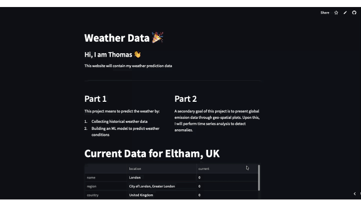
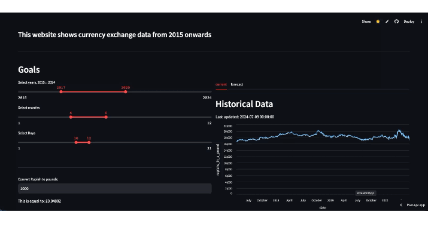
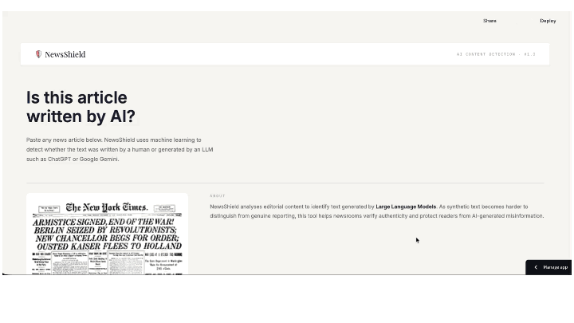
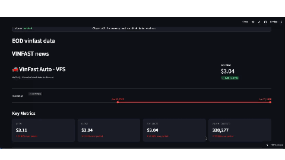

::: {.project-card}

::: {.project-body}
### 🌦 Global Weather & Emissions Intelligence Dashboard

::: {.project-links}
[View app](https://weather-emission.streamlit.app/) &nbsp; [View on GitHub](https://github.com/Thomas-Nguyen12/Weather_website)
:::

This project brings together climate data, machine learning, and interactive analytics to explore how greenhouse-gas emissions and weather patterns vary across the world. I built a Streamlit dashboard that automatically collects global climate and emissions data through API integrations, preprocesses it in Python, and applies ML models to classify countries by emission category.

The dashboard allows users to:

- Analyse global weather and emissions trends in a clean, interactive interface
- Compare countries across multiple environmental indicators
- Explore ML-driven classifications that highlight high-impact regions
- Investigate climate patterns using real-time, continuously updated data

The goal is to provide a practical, accessible tool for stakeholders to monitor climate change, understand environmental risk, and make data-driven decisions. It showcases how data engineering, modelling, and visual storytelling can turn complex environmental datasets into meaningful insight.
:::
:::

::: {.project-card}

::: {.project-body}
### 📈 Exchange-Rate Time Series Analysis & Forecasting Tool

::: {.project-links}
[View app](https://gbp-rupiah-exchange.streamlit.app/) &nbsp; [View on GitHub](https://github.com/Thomas-Nguyen12/GBP_Rupiah_Exchange)
:::

This project explores the dynamics between GBP and the Indonesian Rupiah through a full end-to-end time-series analysis pipeline. I built a system that automatically collects historical exchange-rate data using web-scraping (Requests + BeautifulSoup), cleans and structures the data, and then applies forecasting techniques to uncover trends, volatility patterns, and potential future movements.

The results are presented through an interactive Streamlit dashboard, allowing users to explore historical behaviour, inspect model outputs, and monitor currency shifts in real time.

The project demonstrates how data engineering, statistical modelling, and visual analytics can be combined to create a practical tool for understanding and predicting currency behaviour — offering a clear, accessible way to track macro-economic signals and support decision-making.
:::
:::

::: {.project-card}

::: {.project-body}
### 📰 NewsShield — AI Detection & Classification

::: {.project-links}
[View NewsShield app](https://newsshield.streamlit.app/) &nbsp; [View on GitHub](https://github.com/Thomas-Nguyen12/NewsApplication)
:::

This project investigates how recent surges in A.I. in education and news can influence the media. I have built a model that can classify news topics and detect A.I. generated text. As such, users are able to better question information sources and avoid misinformation.

This project combines: 

- Web-scraped news feeds processed with a custom NLP pipeline (SpaCy + multi-label classification)
- Automated data ingestion using Scrapy, Requests, and BeautifulSoup

:::
:::

::: {.project-card}

::: {.project-body}
### 📰 Vinfast Stock — Analysis and Forecasting

::: {.project-links}
[View VinFast Stock app](https://vinfast-stock-analysis.streamlit.app) &nbsp; [View on GitHub](https://github.com/Thomas-Nguyen12/NewsApplication)
:::

This project combines time-series forecasting, NLP-driven news classification, and automated data pipelines to analyse how real-time news sentiment influences VinFast's stock behaviour. Built as an interactive Streamlit dashboard, it brings together:

- Sentiment-aware forecasting models that predict short-term stock movement
- Visual analytics that help users explore volatility, sentiment shifts, and market signals
- **Agentic AI** to summarise recent news changes
- **CI/CD** to detect data drift in stock data

The goal is to create a tool that improves market research efficiency by automating sentiment extraction and providing forward-looking insights into how narrative trends may shape VinFast's price dynamics. It's a practical example of blending data engineering, machine learning, and explainable analytics into a single, decision-support application.

::: {.callout-warning appearance="simple"}
The VinFast stock app is still **under development** — more updates coming soon.
:::

:::
:::