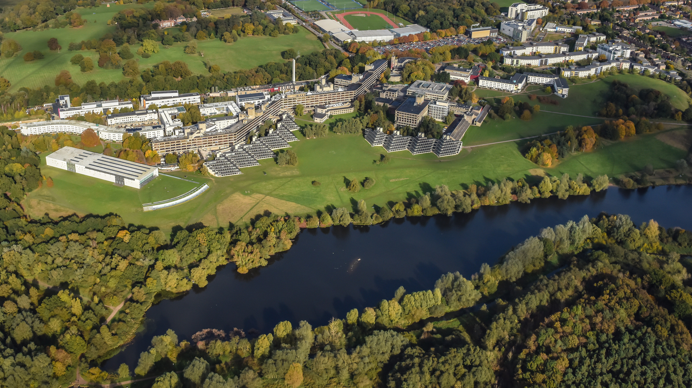

::: {.project-card}

::: {.project-body}
### Associate tutor at UEA | Norwich, England January – July 2025

- I taught basic data science skills within the Data Science for Biologists MSc course at the
University of East Anglia.
- This experience involved communicating technical concepts to beginners.
- This involved foundational skills in R and Unix in high performance computing, navigating
Linux and submission scripts.

:::
:::

::: {.project-card}

::: {.project-body}
### Intern Data Scientist at SWIFT | London, England June 2023 – September 2023

- I researched and implemented Explainable A.I (XAI) techniques, such as SHAP and LIME,
into live ML models.
- I gained significant communication and Python skills, cleaning and analysing data effectively.
- Delivered the impact of interpreting A.I model predictions to an interdisciplinary team. This
led to a 15% productivity increase.

:::
:::

